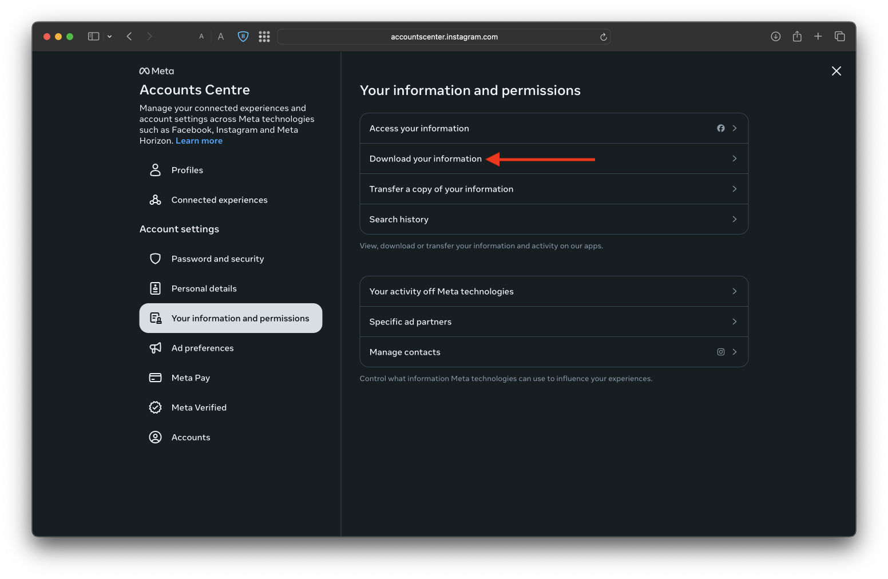
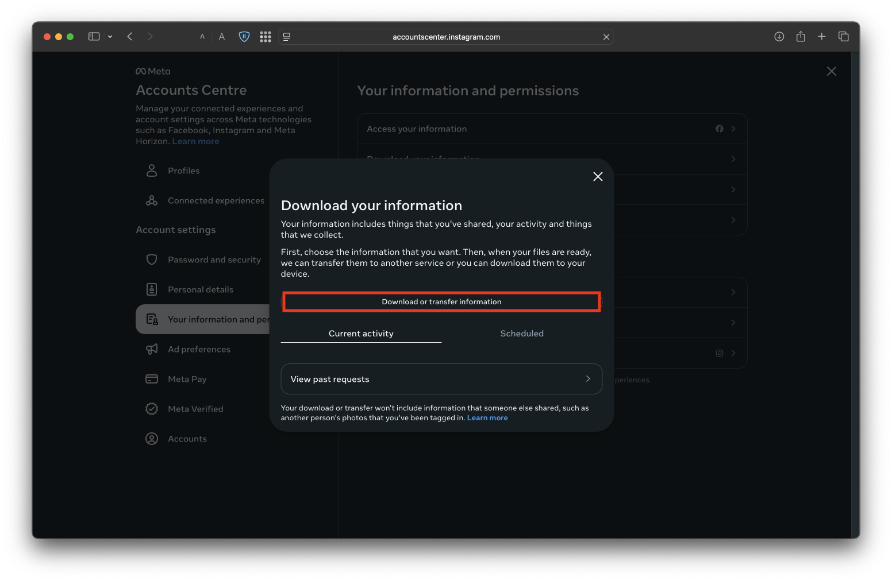
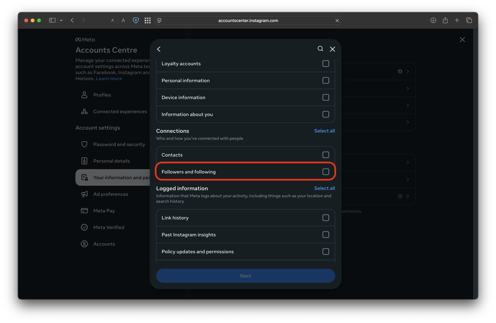
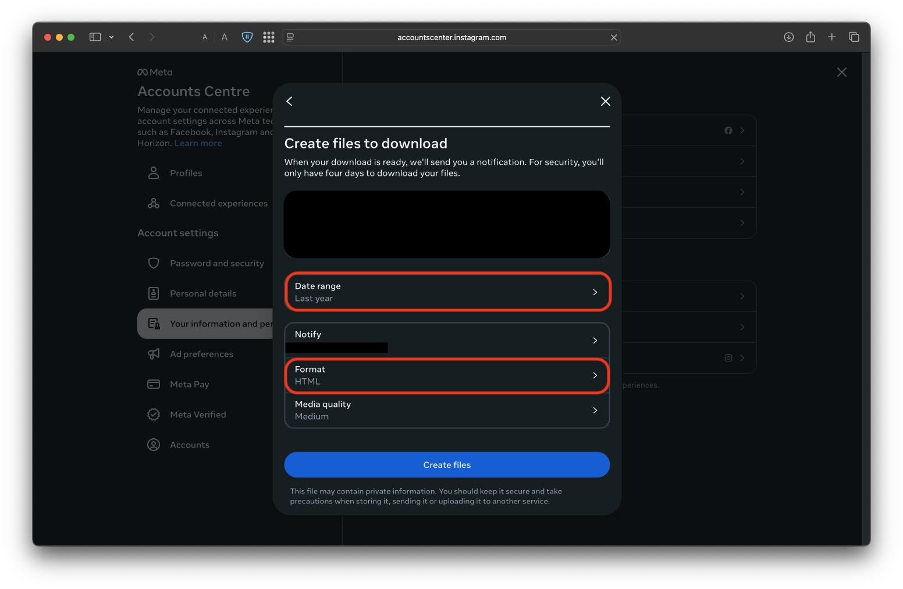

# Unfollowers Checker for Instagram
<p align="center"> 
 


<br>

</p>

A simple React app to check which users you follow on Instagram **do NOT** follow you back — using the official
Instagram data export.

- Runs locally on your browser — No internet connection needed after downloading
- Supports dark and light modes
- Supports `.zip` or raw `.json` files from Instagram
- Whitelist support to ignore specific users

---

## Table of Contents
- [How to get your data from Instagram](#-how-to-get-your-data-from-instagram)
- [Running the app locally](#running-the-app-locally)
- [Running the app in dev mode](#running-the-app-with-hot-reload-dev-only)

---

## 📥 How to Get Your Data from Instagram

1. Go
   to [Instagram's info & permissions center](https://accountscenter.instagram.com/info_and_permissions/?theme=dark)<br>
   

2. Request to download your information<br>
   

3. Select **"All of your information"** or at least make sure **"Followers and following"** is checked<br>
   
   

4. Choose **"Download to device"**

5. Set:
    - **Date range**: `All time`
    - **Format**: `JSON`
      <br>

6. Click **Create files**, wait for Instagram's email, and download the `.zip` file to your computer

---

## Running the App locally

1. Ensure Docker is installed on your device

2. **Clone the repo**:
```bash
git clone https://github.com/YuvalAnteby/Unfollow-Instagram
cd Unfollow-Instagram/src/react_front
```

3. Build and run the project using docker
```bash
docker compose -f docker-compose.prod.yml build --no-cache
docker compose -f docker-compose.prod.yml up -d
```

4. Open your preferred browser and go to `http://localhost:8080/`
 
5. **Select either**:

- The `.zip` file you downloaded from Instagram's email
  **OR**
- The two files: `followers_1.json` and `following.json` in the .zip file


## Running the app with hot reload (dev only)
```bash
git clone https://github.com/YuvalAnteby/Unfollow-Instagram
cd Unfollow-Instagram/src/react_front
```

3. Build and run the project using docker
```bash
docker compose -f docker-compose.dev.yml build
docker compose -f docker-compose.dev.yml up -d
```

4. Open your preferred browser and go to `http://localhost:8080/`

5. **Select either**:

- The `.zip` file you downloaded from Instagram's email
  **OR**
- The two files: `followers_1.json` and `following.json` in the .zip file
