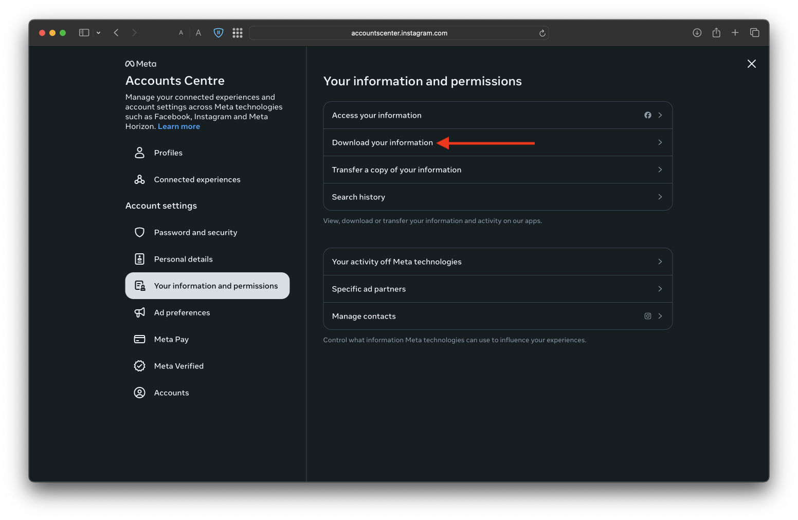
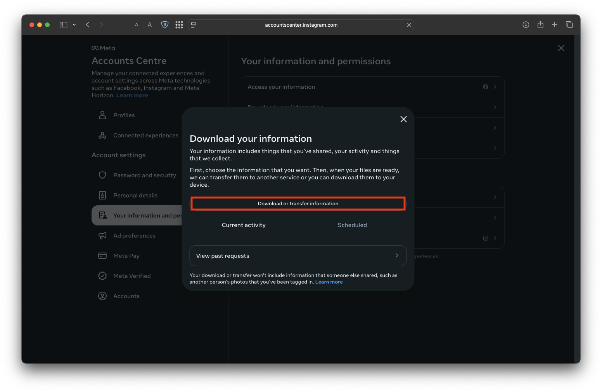
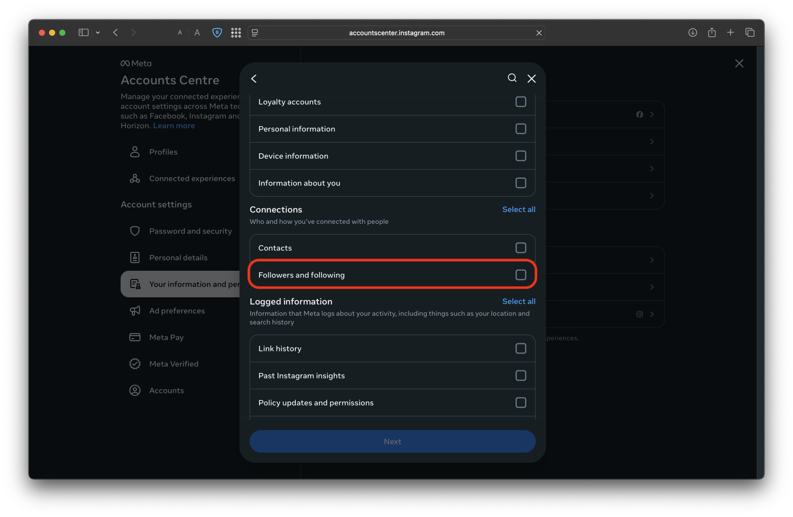
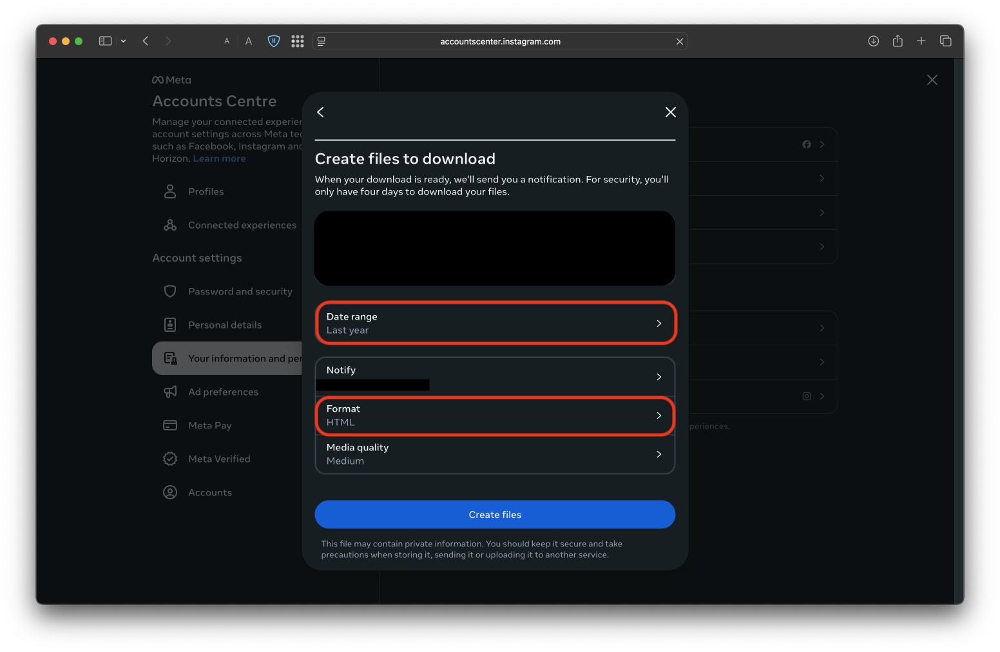

# Unfollowers Checker for Instagram

A simple Python GUI app to check which users you follow on Instagram **do NOT** follow you back — using the official
Instagram data export.

- Runs locally — your data is never shared or uploaded<br>
  (can be deleted anytime by removing `temp_instagram_data` folder)
- Simple UI built with Tkinter
- Supports `.zip` or raw `.json` files from Instagram
- Whitelist support to ignore specific users

---

## 📥 How to Get Your Data from Instagram

1. Go
   to [Instagram's info & permissions center](https://accountscenter.instagram.com/info_and_permissions/?theme=dark)<br>
   

2. Request to download your information<br>
   

3. Select **"All of your information"** or at least make sure **"Followers and following"** is checked<br>
   
   

4. Choose **"Download to device"**

5. Set:
    - **Date range**: `All time`
    - **Format**: `JSON`
      <br>

6. Click **Create files**, wait for Instagram's email, and download the `.zip` file to your computer

---

## 🚀 Setting Up the App

1. **Clone the repo**:

```bash
git clone https://github.com/YuvalAnteby/Unfollow-Instagram-Python
cd Unfollow-Instagram
```

2. **Install the required dependency (Tkinter)**:

```bash
pip install tk
```

> Tkinter is usually pre-installed with Python on most systems. If you get an error, try sudo apt install python3-tk
> (Linux) or brew install python-tk (macOS).

3. **Run the app**:

```bash
python src/gui.py
```

4. **Select either**:

- The `.zip` file you downloaded from Instagram's email
  **OR**
- The two files: `followers_1.json` and `following.json` in the .zip file
